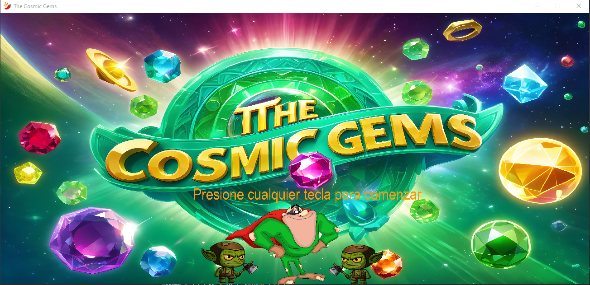
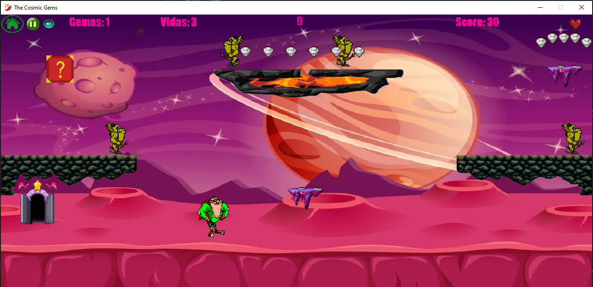
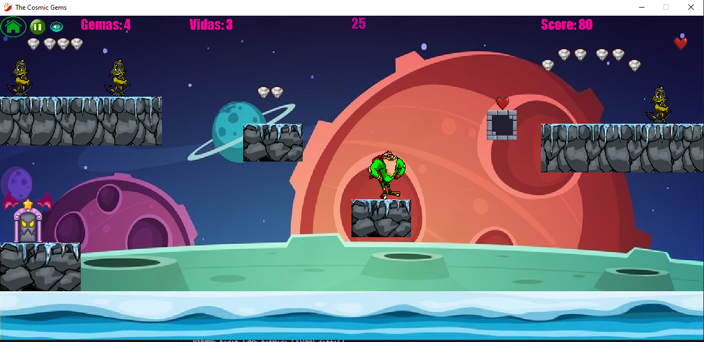
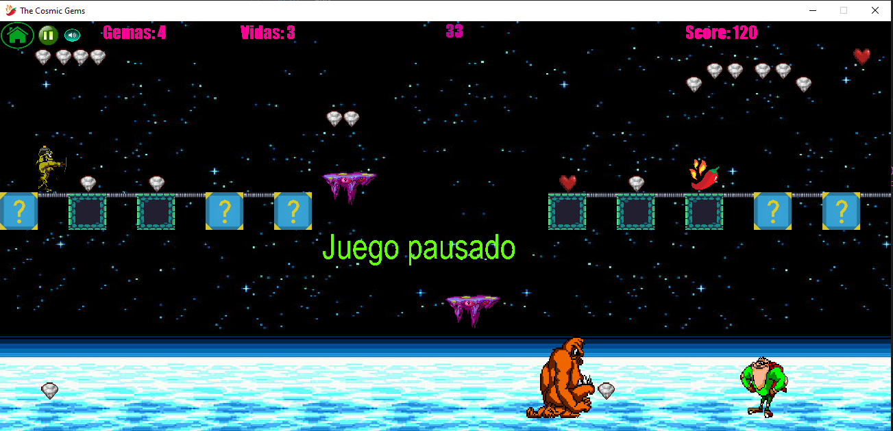

## _JUEGO CON PYGAME - The cosmic gems_

## Sobre el proyecto: Juego de plataformas usando el paradigma orientado a objetos, eventos y la libreria Pygame, capturando colisiones y ejecutando en base a las mismas.

## Objetivo del juego: Coleccionar gemas sin que los enemigos te toquen. Una vez recolectadas debe esperar a que se abra la puerta y regresar. En cada colision con un enemigo se pierden gemas y vidas. En caso de no coleccionar una cantidad determinada, si finaliza el tiempo o se queda sin vidas, pierde el juego.
## El personaje principal puede disparar a sus enemigos, solo si tiene gemas recolectadas.

## Consta de 3 niveles. En el ultimo nivel debera enfrentar al Boss y eliminarlo.

## Hay poderes especiales, gemas y vidas en cajas determinadas.
## Se puede pausar, seleccionar el nivel (solo si se supero anteriormente) y mutear la musica.
## Botones: 

